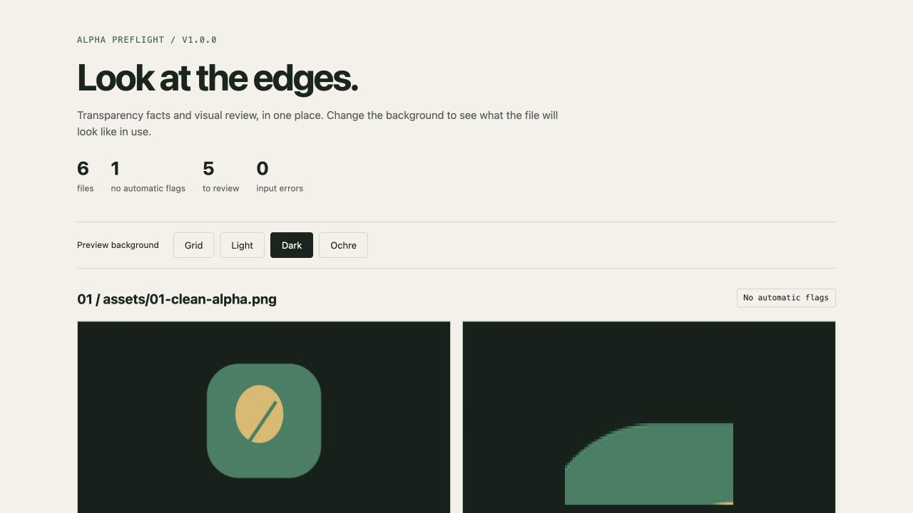

# Alpha Preflight

[Download the standalone Skill](packages/alpha-preflight-v1.0.0.zip)

Look at the edges before you deliver the asset.

Inspect actual image transparency, compare a cutout on different backgrounds, and produce an offline review report. Use the CLI directly or install the Codex skill. Processing is local; Python and Pillow are the only runtime requirements.

[中文](README.md) · [Skill](skills/alpha-preflight/SKILL.md) · [How the checks work](skills/alpha-preflight/references/interpretation.md)



## Run

Use Python 3.10 or newer, from the repository directory:

```sh
python3 -m venv .venv
.venv/bin/python -m pip install -r skills/alpha-preflight/requirements.txt
.venv/bin/python skills/alpha-preflight/scripts/inspect_alpha.py ./images --out ./report
```

Replace `./images` with your image or folder. Open `report/index.html` directly in a browser; `report/report.json` contains the measurements. On Windows, use `.venv\Scripts\python.exe` instead of `.venv/bin/python`.

You can supply several files or folders. Choose a new output directory each time. Existing reports are never overwritten, and source files are never changed.

## What you get

- Actual transparent, semitransparent, and opaque pixel counts, including indexed PNG transparency and colour keys.
- Visible bounds, margins, and canvas-contact measurements.
- Offline light, dark, grid, and ochre backgrounds, with a magnified source region beside each overview.
- Explicit soft-boundary and painted-grid heuristics, labelled as hints rather than confirmed defects.
- Separate records for unreadable or unsupported files, plus source fingerprints for successful inspections.

An alpha channel containing only opaque pixels is not transparency. “No automatic flags” does not certify visual quality. Intentional outlines and tiled artwork can trigger hints; coloured halos, hard fringes, faint edges, and fine hair can be missed. The tool performs inspection and does not remove backgrounds or modify artwork.

## Use as a skill

Copy `skills/alpha-preflight` into your skill directory:

```sh
mkdir -p "${CODEX_HOME:-$HOME/.codex}/skills"
cp -R -n skills/alpha-preflight "${CODEX_HOME:-$HOME/.codex}/skills/"
```

Reload skills, provide images or paths, and ask for an inspection with `$alpha-preflight`. The folder includes the script, dependency list, interpretation reference, and license. Other `SKILL.md` hosts need local Python execution and file preview capabilities to run this workflow.

## Reproduce the demo

Download and open the included [HTML report](docs/demo/index.html); the [JSON report](docs/demo/report.json) contains the measurements. Six synthetic, script-drawn fixtures illustrate genuine transparency, opaque alpha, a painted grid, a light soft boundary, canvas contact, and an empty image.

```sh
.venv/bin/python examples/make_samples.py ./new-samples
.venv/bin/python skills/alpha-preflight/scripts/inspect_alpha.py ./new-samples --out ./new-demo
.venv/bin/python -m unittest discover -s tests -v
```

## Scope

Static, 8-bit PNG, WebP, and JPEG; up to 100 images per report and 40 megapixels per image. Directory scans recurse while skipping hidden directories and symlinks. Animated images and 16-bit PNGs are rejected instead of silently inspecting one frame or reducing bit depth.

Preview colours are converted to 8-bit sRGB when embedded profiles are readable; untagged images are assumed sRGB. Source files remain intact. Preview metadata is removed, but reports still contain visible artwork, so review their contents before sharing.

Exit `0` means a report was written without input errors. Input/decode/write errors exit `1`. `--fail-on-review` exits `2` for review flags when there are no input errors. Argument errors also exit `2` and produce no report. These are inspection outcomes, not visual approval.

## Contribute

A publicly shareable failure sample, its expected behaviour, and the actual report are useful contributions. False positives, missed patterns, and colour-profile cases are particularly welcome. Keep checks explainable; avoid opaque aggregate quality scores. Code, documentation, and fixtures use the [MIT License](LICENSE).
